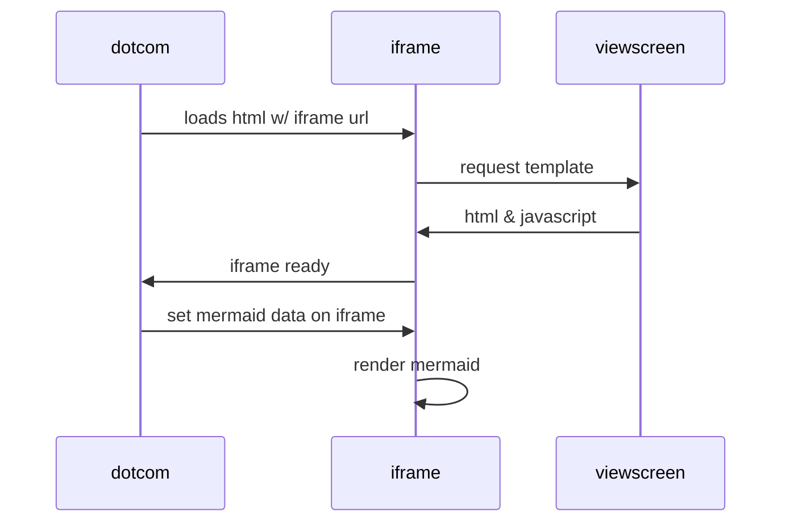

+++
title = "Mermaid测试贴"
date = 2022-05-29T13:30:38+08:00
draft = false
author = "杨武杰"
categories = [ "工具" ]
tags = [ "Hugo", "mermaid" ]
year = "2022"
month = "2022/05"
+++

测试[mermaid](https://mermaid-js.github.io/mermaid/#/)能否工作。
<!--more-->

