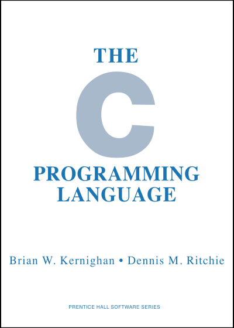

+++
title = "链表"
outputs = ["Reveal"]
date = 2022-05-31T18:24:50+08:00
draft = false
author = "杨武杰"
categories = [ "演示文稿" ]
tags = [ "C", "链表" ]
year = "2022"
month = "2022/05"
+++



C语言的
# 链表
及函数的参数传递

---


---

## 链表 vs 数组

- 数组长度固定，而链表长度可动态变化。
- 数组可以随机存取，而链表只能顺序存取。
- 链表中的数据，可以根据需要插入或删除。
- 链表涉及大量指针操作，使用难度较高。
- 存储同样数量的数据，链表的时间和空间开销都比数组大。

---

{}

## 链表的基本概念

---

- 把需要存储的数据和一个额外的指针组合成同一个数据结构，然后让指针指向下一个这样的数据结构
- 这样的数据结构，一个接一个依次相连，就可以组成任意长度的链表

```goat

.--------+---.     .--------+---.     .--------+---.
|  data  | *-+---->|  data  | *-+---->|  data  | o |
.--------+---.     .--------+---.     .--------+---.
```

---

## 定义链表节点

```C
struct node {
    int data;
    struct node *next;
};
```

---

```C
struct node *head;
head = (struct node *)malloc(sizeof(struct node));
if (head != NULL) {
	head->data = 1;
	head->next = NULL;
}
```

```goat
 head
  |           .---------+---.
  .---------->|    1    | o |
              .---------+---.
```

---

```C
struct node *new;
new = (struct node *)malloc(sizeof(struct node));
if (new != NULL) {
	new->data = 2
}
```

```goat
 new
  |           .---------+---.
  .---------->|    2    | ? |
              .---------+---.
```

---

## 如何做到？

- 把`new`和`head`两个节点链接起来
- 让`new`在前，`head`在后
- 让`head`也指向`new`,效果图如下
  
```goat

 head
  |           .---------+---.          .---------+---.
  .---------->|    2    | *-+--------->|    1    | o |
              .---------+---.          .---------+---.
```

---

```C
new->next = head;
head = new;
```

```goat

 new                              head
  |           .---------+---.      |          .---------+---.
  .---------->|    2    | ? |      .--------->|    1    | o |
              .---------+---.                 .---------+---.
```

---

```C {linenos=inline,hl_lines=1}
new->next = head;
head = new;
```

```goat

 new                              head
  |           .---------+---.      |          .---------+---.
  .---------->|    2    | *-+------+--------->|    1    | o |
              .---------+---.                 .---------+---.
```

---

```C {linenos=inline,hl_lines=2}
new->next = head;
head = new;
```

```goat

 new    .----------------------- head
  |     |     .---------+---.                 .---------+---.
  .-----+---->|    2    | *-+---------------->|    1    | o |
              .---------+---.                 .---------+---.
```

---

- 我们不关心`new`指向哪里，上图和下面的图实际上是一样的

```goat

 head
  |           .---------+---.          .---------+---.
  .---------->|    2    | *-+--------->|    1    | o |
              .---------+---.          .---------+---.
```

{}

---

{}

## 链表的基本操作

---

## 链表遍历

- 通过前面的操作，我们实际上已经创建了一个包含两个节点的链表。
- 重复在链表头插入新节点，即可创建任意长度的链表。
- 在继续进行下去之前，先编写一个打印链表的函数，用以辅助验证程序的正确性。

```C
void print_list(struct node *head)
{
	struct node *current = head;
	while (current != NULL) {
		printf("%d\n", current->data);
		current = current->next;
	}
}
```

---

## 程序能简化吗？

- 实现链表遍历的代码很简单：控制`current`变量，每次指向链表中的下一个节点，直到尾部。
- 真的需要`current`变量吗？能否把程序简化成如下的样子？

```C
void print_list(struct node *head)
{
	while (head != NULL) {
		printf("%d\n", head->data);
		head = head->next;
	}
}
```

---

- 简化后的程序正确与否，拿下面的程序测试一下就知道了：
```C
#include <stdlib.h>
#include <stdio.h>

struct node {
	int data;
	struct node *next;
};

void print_list(struct node *head)
{
	while (head != NULL) {
		printf("%d\n", head->data);
		head = head->next;
	}
}

int main()
{
	struct node *head;
	head = (struct node *)malloc(sizeof(struct node));
	if (head != NULL) {
		head->data = 1;
		head->next = NULL;
	}

	print_list(head);
	print_list(head);
	return 0;
}
```

---

## 插入节点

- 之前我们已经完成了向链表中插入新节点的操作。因为这是一个基本且常用的操作，这里把它抽象为一个函数。
- 假设变量`head`指向链表头节点（可以为NULL，表示链表中当前无节点），变量`new`指向待插入节点。
- 函数名如果用`insert`可能有歧义（插入在`head`之前还是之后？）。为避免歧义，假设函数名为`push`。

---

- 函数这样写没问题吧？
```C
void push(struct node *head, struct node *new)
{
	new->next = head;
	head = new;
}
```

---

- 正确与否测试便知：

```C
#include <stdlib.h>
#include <stdio.h>

struct node {
	int data;
	struct node *next;
};

void print_list(struct node *head)
{
	while (head != NULL) {
		printf("%d\n", head->data);
		head = head->next;
	}
}

void push(struct node *head, struct node *new)
{
	new->next = head;
	head = new;
}

int main()
{
	struct node *head, *new;
	head = (struct node *)malloc(sizeof(struct node));
	if (head != NULL) {
		head->data = 1;
		head->next = NULL;
	}
	else
		exit(1);
	new = (struct node *)malloc(sizeof(struct node));
	if (new != NULL) {
		new->data = 2;
		push(head, new);
	}
	else
		exit(1);
	print_list(head);
	return 0;
}
```

{}

---

{}

很遗憾，结果不正确

## 问题出在哪里？

---

## 要解决问题，须先知道问题所在

- 程序运行后只打印出了一个“1”。
- 既然打印出“1”了，说明`push`被调用了。
- 是`print_list`的问题还是`push`的问题？
- 很自然，在`push`之后，`print_list`之前，增加一个检查点，观察程序状态是否符合预期，即可找出问题所在。
- 最方便的工具就是用调试器跟踪调试。

---

## `printf`是穷人版的调试器

- 在程序的如下位置增加一个`printf`语句：
```C {linenos=inline,linenostart=34,hl_lines=9}
	new = (struct node *)malloc(sizeof(struct node));
	if (new != NULL) {
		new->data = 2;
		push(head, new);
	}
	else
		exit(1);

	printf("Head node: %d\n", head->data);

	print_list(head);
```

---

- 程序的运行结果如下。
- 结果显示，`push`之后，`head`节点中的数据确实是1。
- 据此可知，问题大抵出在`push`函数。
```nohighlight
Head node: 1
1
```

---

## 重新审视`push`函数

```C {linenos=inline,hl_lines=4}
void push(struct node *head, struct node *new)
{
	new->next = head;
	head = new;
}
```
- `push`明明把`head`指向了新插入的节点，但为什么在调用`push`之后`head`中的值仍然是1呢？

---

- 故技重施，在`push`里再设个检查点：

```C {linenos=inline,hl_lines=5}
void push(struct node *head, struct node *new)
{
	new->next = head;
	head = new;
	printf("Head node(in push): %d\n", head->data);
}
```

---

- 再次运行程序，得到的结果如下。`head`节点的内容从`push`函数返回之后神奇地发生变化了！
```nohighlight
Head node(in push): 2
Head node: 1
1
```

此`head`非彼`head`？

{}

---

{}

## 函数调用时的参数传递

---

- 要弄清楚问题所在，先要弄清楚C语言的参数传递规则。
- C语言的参数传递规则非常简单：**传值**。
- C语言**不支持**传引用。
- 不要受其他语言影响，也不要受有些资料不准确的说法蛊惑。
- 请参考[Passing by reference in C](https://stackoverflow.com/questions/2229498/passing-by-reference-in-c)

---

[](https://en.wikipedia.org/wiki/The_C_Programming_Language)

---

## C语言的发明者的说法

> In C, all function arguments are passed "by value." This means that the called function is given the values of its arguments in temporary variables rather than the originals...
in C the called function cannot directly alter a variable in the calling function; it can only alter its private, temporary copy.

---

> 在C中，所有函数参数都是传值的。这意味着被调用的函数被给与的不是原来的变量，而是临时性的变量，其中包含了参数的值...在C中，被调用函数不能直接修改调用者的变量；它只能修改它自己私有的临时性的版本。

---

- `push`的两个参数都是 `struct node *` 类型
- 指针类型的变量的值即该变量中记录的地址
- 调用`push`时，实际上是复制了两个指针变量
- 虽然`main`和`push`里都有`head`和`new`变量，但它们实际上是不同的变量

{}

---

{}

## 参数传递过程详解

---

- 进入`push`时的状态

```C
void push(struct node *head, struct node *new)
{
	new->next = head;
	head = new;
}
```

```goat
.--------------------------------------------------------------------.
|  main                                                              |
|                                                                    |
|                                              .------------------.  |
|       .---.            .---------.---.       |  push            |  |
|  head | *-+------.---->|    1    | * |       |                  |  |
|       .---.      |     .---------.---.       |      .---.       |  |
|                  .---------------------------+------+-* | head  |  |
|                                              |      .---.       |  |
|       .---.            .---------.---.       |                  |  |
|   new | *-+------.---->|    2    | ? |       |                  |  |
|       .---.      |     .---------.---.       |      .---.       |  |
|                  .---------------------------+------+-* | new   |  |
|                                              |      .---.       |  |
|                                              .------------------.  |
.--------------------------------------------------------------------.
```

---

- 执行了“`new->next = head;`”语句之后的状态：
```C {linenos=inline,hl_lines=3}
void push(struct node *head, struct node *new)
{
	new->next = head;
	head = new;
}
```

```goat
.--------------------------------------------------------------------.
|  main                                                              |
|                                                                    |
|                  .----------------------.    .------------------.  |
|       .---.      |     .---------.---.  |    |  push            |  |
|  head | *-+------.---->|    1    | * |  |    |                  |  |
|       .---.      |     .---------.---.  |    |      .---.       |  |
|                  .----------------------)----+------+-* | head  |  |
|                                         |    |      .---.       |  |
|       .---.            .---------.---.  |    |                  |  |
|   new | *-+------.---->|    2    | *-+--.    |                  |  |
|       .---.      |     .---------.---.       |      .---.       |  |
|                  .---------------------------+------+-* | new   |  |
|                                              |      .---.       |  |
|                                              .------------------.  |
.--------------------------------------------------------------------.
```

---

- 从`push`返回之前的状态

```C {linenos=inline,hl_lines=4}
void push(struct node *head, struct node *new)
{
	new->next = head;
	head = new;
}
```

```goat
.--------------------------------------------------------------------.
|  main                                                              |
|                                                                    |
|                  .----------------------.    .------------------.  |
|       .---.      |     .---------.---.  |    |  push            |  |
|  head | *-+------.---->|    1    | * |  |    |                  |  |
|       .---.            .---------.---.  |    |      .---.       |  |
|                  .----------------------)----+------+-* | head  |  |
|                  |                      |    |      .---.       |  |
|       .---.      |     .---------.---.  |    |                  |  |
|   new | *-+------.---->|    2    | *-+--.    |                  |  |
|       .---.      |     .---------.---.       |      .---.       |  |
|                  .---------------------------+------+-* | new   |  |
|                                              |      .---.       |  |
|                                              .------------------.  |
.--------------------------------------------------------------------.
```
---

- 从`push`返回之后的状态

```goat
.--------------------------------------------------------------------.
|  main                                                              |
|                                                                    |
|                  .----------------------.                          |
|       .---.      |     .---------.---.  |                          |
|  head | *-+------.---->|    1    | * |  |                          |
|       .---.            .---------.---.  |                          |
|                                         |                          |
|                                         |                          |
|       .---.            .---------.---.  |                          |
|   new | *-+----------->|    2    | *-+--.                          |
|       .---.            .---------.---.                             |
|                                                                    |
|                                                                    |
|                                                                    |
.--------------------------------------------------------------------.
```

{}

---

{}

那么，
## 如何修正这个错误呢？

---

- 看了刚才的状态图，我有一个冲动，想这样改，在`push`返回之后加一行：

```C {linenos=inline,linenostart=34,hl_lines=5}
	new = (struct node *)malloc(sizeof(struct node));
	if (new != NULL) {
		new->data = 2;
		push(head, new);
		head = new;
	}
	else
		exit(1);

	printf("Head node: %d\n", head->data);

    print_list(head);
```

---

- 测试之后，得到了如下结果：

```nohighlight
Head node(in push): 2
Head node: 2
2
1
```

喔！结果对了！

但是，

**不要这样做！**

---

## 为什么？

- 这样做，让`push`函数的存在完全失去意义
- 程序很难读懂
- 程序容易出错，维护成本高

---

## 正确方案

```C
void push(struct node **head, struct node *new)
{
	new->next = *head;
	*head = new;
}
```

- 这个方案受原来的`push`函数启发。原来的`push`函数虽然无法修改`main`函数里的`head`变量，也无法修改`main`函数里的`new`变量，但它修改了`new`变量指向的节点！
- 这个修正的版本里，`push`函数里的`head`指向`main`里的`head`，而不是指向`main`里的`head`指向的节点

---

- 在`main`函数里调用`push`时应该这样调用，这样传递给`push`的不是`head`，而是指向`head`的指针，从而让`push`能够修改`head`：

```C
push(&head, new);
```

---

- 进入`push`时的状态

```C
void push(struct node **head, struct node *new)
{
	new->next = *head;
	*head = new;
}
```

```goat
.--------------------------------------------------------------------.
|  main                                                              |
|                                                                    |
|                                              .------------------.  |
|  head .---.            .---------.---.       |  push            |  |
|    .->| *-+----------->|    1    | * |       |                  |  |
|    |  .---.            .---------.---.       |      .---.       |  |
|    .-----------------------------------------+------+-* | head  |  |
|                                              |      .---.       |  |
|       .---.            .---------.---.       |                  |  |
|   new | *-+------.---->|    2    | ? |       |                  |  |
|       .---.      |     .---------.---.       |      .---.       |  |
|                  .---------------------------+------+-* | new   |  |
|                                              |      .---.       |  |
|                                              .------------------.  |
.--------------------------------------------------------------------.
```

---

- 执行了语句“`new->next = *head;`”语句后的状态

```C {linenos=inline,hl_lines=3}
void push(struct node **head, struct node *new)
{
	new->next = *head;
	*head = new;
}
```

```goat
.--------------------------------------------------------------------.
|  main                                                              |
|                                                                    |
|                    .--------------------.    .------------------.  |
|  head .---.        |   .---------.---.  |    |  push            |  |
|    .->| *-+--------.-->|    1    | * |  |    |                  |  |
|    |  .---.            .---------.---.  |    |      .---.       |  |
|    .------------------------------------)----+------+-* | head  |  |
|                                         |    |      .---.       |  |
|       .---.            .---------.---.  |    |                  |  |
|   new | *-+------.---->|    2    | *-+--.    |                  |  |
|       .---.      |     .---------.---.       |      .---.       |  |
|                  .---------------------------+------+-* | new   |  |
|                                              |      .---.       |  |
|                                              .------------------.  |
.--------------------------------------------------------------------.
```

---

- 从`push`返回之前的状态

```C {linenos=inline,hl_lines=4}
void push(struct node **head, struct node *new)
{
	new->next = *head;
	*head = new;
}
```

```goat
.--------------------------------------------------------------------.
|  main                                                              |
|                                                                    |
|                    .--------------------.    .------------------.  |
|  head .---.        |   .---------.---.  |    |  push            |  |
|    .->| *-+------. .-->|    1    | * |  |    |                  |  |
|    |  .---.      |     .---------.---.  |    |      .---.       |  |
|    .-------------)----------------------)----+------+-* | head  |  |
|                  |                      |    |      .---.       |  |
|       .---.      |     .---------.---.  |    |                  |  |
|   new | *-+------.---->|    2    | *-+--.    |                  |  |
|       .---.      |     .---------.---.       |      .---.       |  |
|                  .---------------------------+------+-* | new   |  |
|                                              |      .---.       |  |
|                                              .------------------.  |
.--------------------------------------------------------------------.
```

---

- 从`push`返回之后的状态

```goat
.--------------------------------------------------------------------.
|  main                                                              |
|                                                                    |
|                    .--------------------.                          |
|  head .---.        |   .---------.---.  |                          |
|       | *-+------. .-->|    1    | * |  |                          |
|       .---.      |     .---------.---.  |                          |
|                  |                      |                          |
|                  |                      |                          |
|       .---.      |     .---------.---.  |                          |
|   new | *-+------.---->|    2    | *-+--.                          |
|       .---.            .---------.---.                             |
|                                                                    |
|                                                                    |
|                                                                    |
.--------------------------------------------------------------------.
```

---

- 整理后的完整代码如下，运行后应该可以得到预期的结果：

```C
#include <stdlib.h>
#include <stdio.h>

struct node {
	int data;
	struct node *next;
};

void print_list(struct node *head)
{
	while (head != NULL) {
	printf("%d\n", head->data);
	head = head->next;
	}
}

void push(struct node **head, struct node *new)
{
	new->next = *head;
	*head = new;
}

int main()
{
	struct node *head, *new;
	head = (struct node *)malloc(sizeof(struct node));
	if (head != NULL) {
		head->data = 1;
		head->next = NULL;
	}
	else
		exit(1);
	new = (struct node *)malloc(sizeof(struct node));
	if (new != NULL) {
		new->data = 2;
		push(&head, new);
	}
	else
		exit(1);
	print_list(head);
	return 0;
}

```

{}

---



# 让我们的程序看起来更专业

---

{}

## typedef

---

- `struct node`是我们的核心数据结构，经常用到。利用C的`typedef`关键字可以让程序更精练、更易读。
- 之后凡用到`struct node`的地方均可用`node_t`替代。

```C
struct node {
	int data;
	struct node *next;
};

typedef struct node node_t;
```

---

- 还有一种更精炼的写法：

```C
typedef struct node {
	int data;
	struct node *next;
} node_t;
```

{}

---

{}

## const

---

```C
void print_list(struct node *head);
```

- `print_list`函数原型如上。定义了`node_t`之后，可以写成这样子：

```C
void print_list(node_t *head);
```

- 我们知道，`print_list`是有能力修改`head`指向的节点的，但`print_list`函数并不需要这种能力。我们可以清楚地表明这一点，从而让程序更加容易理解和维护：

```C
void print_list(const node_t *head);
```

---

`push`的原型是否可以修改，也加上`const`关键字呢？

```C
void push(const node_t **head, node_t *new);
```
- 答案是不行，因为`push`要修改`new`和`head`指向的数据。

---

在程序中添加`const`关键字这样的修饰

并非功能上的需要

目的是在编译器的帮助下

确保你实际表达的和你想要表达的意思一致

这也有助于提高程序的可读性

因为函数实际做的在函数原型已经部分表达了出来

相当于为程序写了高质量的文档

---

- 整理后的程序：

```C {linenos=inline}
#include <stdlib.h>
#include <stdio.h>

typedef struct node {
	int data;
	struct node *next;
} node_t;

void print_list(const node_t *head)
{
	while (head != NULL) {
		printf("%d\n", head->data);
		head = head->next;
	}
}

void push(node_t ** head, node_t *new)
{
	new->next = *head;
	*head = new;
}

int main()
{
	node_t *head, *new;
	head = (node_t *)malloc(sizeof(node_t));
	if (head != NULL) {
		head->data = 1;
		head->next = NULL;
	}
	else
		exit(1);
	new = (node_t *)malloc(sizeof(node_t));
	if (new != NULL) {
		new->data = 2;
		push(&head, new);
	}
	else
		exit(1);
	print_list(head);
	return 0;
}
```

{}

---

{}

## 释放动态分配的内存

---

- 之前一直关注程序的基本功能，没有释放动态分配的内存。现在写一个专门的函数完成这件事。
- 模仿`print_list`这样写可以吗？

```C
void free_list(node_t * head)
{
	while (head != NULL) {
		free(head);
		head = head->next
	}
}
```

---

- 刚才的程序有错，这个程序同样有错。错误原因请自行分析，如有疑问请看[内存布局]()相关讲解。

```C
void free_list(node_t * head)
{
	while (head != NULL) {
		free(head);
		head = head->next
	}
}
```

---

- 正确的程序：

```C
void free_list(node_t * head)
{
	node_t *next;
	while (head != NULL) {
		next = head->next;
		free(head);
		head = next;
	}
}
```

---

- `free_list`的函数原型可以这样写吗？

```C
void free_list(const node_t *head);
```

{}

---

{}

## 让程序的组织更显有序

---

- 随着程序功能的完善，程序的规模会越来越大，这时程序的有序组织就显得尤为重要。
- 这里，我们可以把实现链表基本功能的代码和使用这些功能的代码分开。

---

- 创建一个名为`list.h`的文件，里面写入如下内容：

```C
typedef struct node {
	int data;
	struct node *next;
} node_t;

void print_list(const node_t *head);
void push(node_t ** head, node_t *new);
void free_list(node_t * head);
```

---

- 创建一个名为`list.c`的文件，里面写入如下内容：

```C
#include <stdio.h>
#include <stdlib.h>
#include "list.h"

void print_list(const node_t *head)
{
	printf("List:");
	while (head != NULL) {
		printf(" %d", head->data);
		head = head->next;
	}
	printf("\n");
}

void push(node_t ** head, node_t *new)
{
	new->next = *head;
	*head = new;
}

void free_list(node_t * head)
{
	node_t *next;
	while (head != NULL) {
		next = head->next;
		free(head);
		head = next;
	}
}
```

---

- 创建一个名为`main.c`的文件，里面写入如下内容：

```C
#include <stdio.h>
#include <stdlib.h>
#include "list.h"

int main()
{
	node_t *head = NULL;
	for (int i = 0; i < 10; i++) {
		node_t *new = (node_t *)malloc(sizeof(node_t));
		if (new != NULL) {
			new->data = i;
			new->next = NULL;
			push(&head, new);
		}
	}

	print_list(head);
	free_list(head);

	return 0;
}
```

---

- 用如下的命令建造程序并运行，将打印出10各倒序排列的数字：

```bash
$ gcc main.c list.c -o list
$ ./list
```
```nohighlight
List: 9 8 7 6 5 4 3 2 1 0
```

{}

---

{}

## 完善链表基本操作

---

- `push`的逆操作`pop`:
  
```C
node_t *pop(node_t **head)
{
	node_t *result = *head;
	if (*head != NULL) {
		*head = (*head)->next;
	}
	return result;
}
```

---

- 在链表中删除包含指定数据的第一个节点：

```C
void delete(node_t **head, int data)
{
	node_t *prev = NULL;
	node_t *curr = *head;

	while (cuur != NULL) {
		if (curr->data == data) {
			if (prev != NULL)
				prev->next = curr->next;
			else
				*head = curr->next;
			break;
		}
		prev = curr;
		curr = curr->next;
	}
}
```

---

- 在指定节点之后插入一个节点，请自行补全代码：

```C
void insert_after(node_t *prev, node_t *new)
{
	...
}
```

---

- 链表还应该具有哪些基本操作？请补充完善。
- 函数实现之后，应写出完善的测试代码，保证程序的正确性。

{}

---

## Happy Hacking